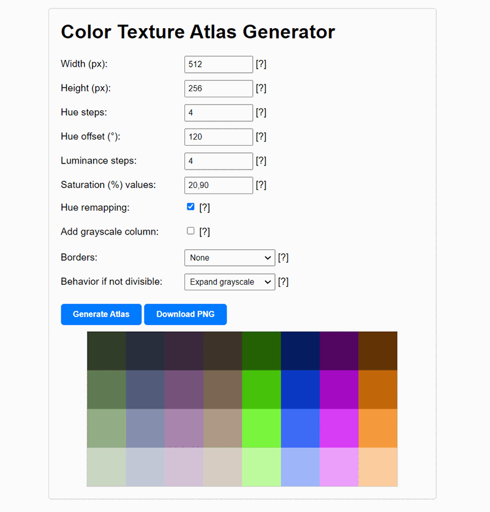

# Color Atlas Generator

The Color Atlas Generator is an open-source project that allows you to create atlases for texturing 3D models with flat colors. This allows you to use only one material, which is particularly useful for game development. It was originally created for internal use when developing games in the good old "low poly, flat colors" style at Rhombico Games.

## Overview

The Color Atlas Generator is written in HTML, plain JavaScript, and CSS, with no frameworks required to make it work. It provides a simple interface to generate color texture atlases with several options to customize the output.

## Features

- Customize the width and height of the texture atlas
- Specify the number of different hues and luminance steps to be used in the atlas
- Offset all hues by a certain amount of degrees
- Define different saturation values for colors in the atlas
- Experimental hue remapping option for greater color variety (from a perceptual point of view)
- Add a grayscale column at the start of the atlas
- Different border styles
- Export atlas textures to PNG format

## Online Demo

Check out the [online demo at Rhombico Games](https://www.rhombicogames.com/color-atlas-generator/) to see the Color Atlas Generator in action.

## Minified Version

There's also a minified version of the project in this repository, which includes all CSS and JavaScript needed to make it work in just one HTML file. So, if you just want to run it locally or embed it on your own website, you can go ahead and use that one.

## Screenshots

More screenshots in the screenshots directory.

## License

This project is distributed under the MIT License. See the [LICENSE](LICENSE) file for more information.